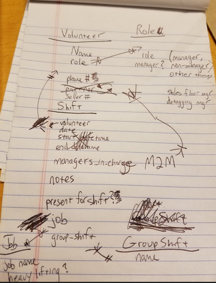

# tpom-vsa
TPOM Volunteer Scheduling Assistant

tpom-vsa is YASA (yet another scheduling app), but this particular one has been purpose-built to _quickly_ satisfy 
the requirements of the TPOM VP of Member Sales for scheduling volunteers at the bi-annual Member Sale.

Most of the magic of this application is built-in to the Django framework, particularly from using the built-in features of the Django Admin.

The only custom code is the View for getting a JSON representation of the shifts from the Date selected - for use with Google Gantt charts.
There is also a data importer script, which uses a spreadsheet/csv from a different system (where people sign up to volunteer).

This app is designed to interact with and enhance the volunteer, role, shift, and job information related to the TPOM Member Sale volunteers.

###Rough sketch ERD over dinner:

### To Do:
dummy csv file for example data
